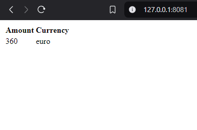
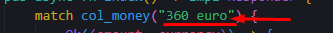

# traqio-auth-rs
## About project

## 🌐 Socials:
[](https://instagram.com/i.karakhan) [](https://www.linkedin.com/in/inal-garali-876a29313/)

# 💻 Use Technology:


# Project Setup
## Build Project
```sh
cargo build
```
## Run Project
```sh
cargo run
```
# Testing Project
## Register Function


## Input Data

